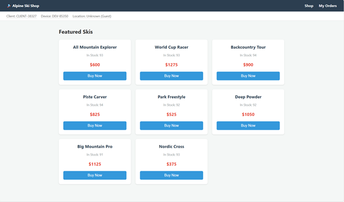
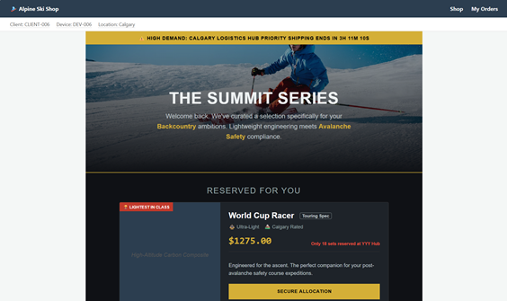
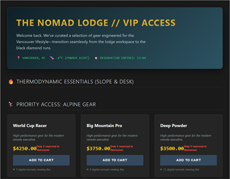
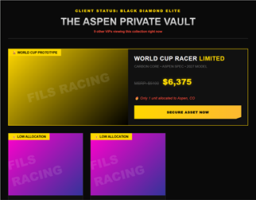
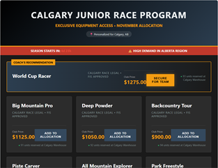
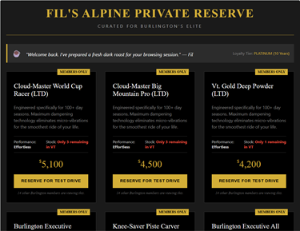
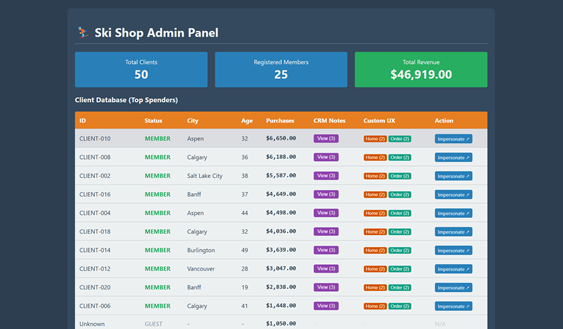
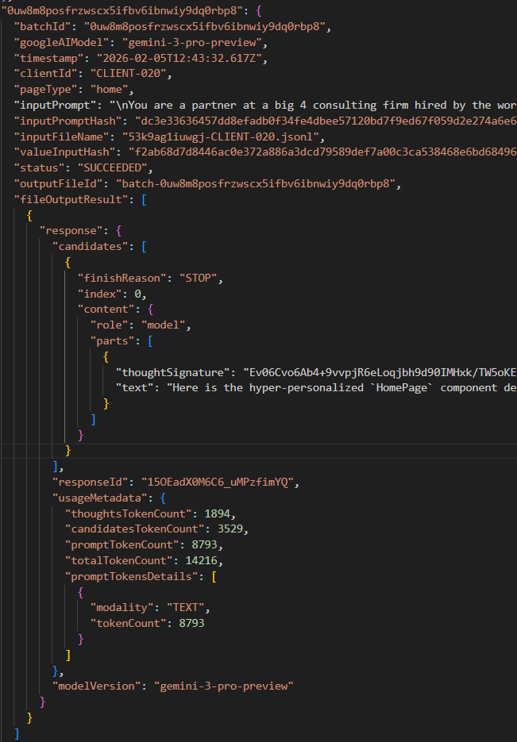

# Terminal Value: A Pipeline That Generates Contextual Web Components Via LLM

This repo is a sandbox rooted in an architecture concept I summarize as "probabilistic core, deterministic shell." The hypothesis is that by treating LLMs as probabilistic software systems, and applying engineering principles to mitigate their inherent downsides, we can invoke them transactionally to serve higher-order logic in a predictable way.

For example, the pipeline currently references a **Base Home Page Web Component** from an mock e-commerce web app:

It combines this base component with user-specific context (i.e., notes from a CRM system) then feeds it to an LLM, in a fully automated way, to generate a **Client-Specific Home Page Web Component:**

This user-specific component is then served and rendered dynamically for the appropriate user through the original mock e-commerce web app.

Each custom web component is generated in one-shot using about 10,000 tokens, averaging around ~4kb unminified size. Sample raw responses from Gemini Batch APIs that show raw prompt input, raw LLM response and detailed token usage metadata can be found in `./apps/gemini-batch/local-inputs`.

The framework and architecture behind this approach is the namesake of this repository, Terminal Value. The result is not quite MCP, vibe coding, LLM as a compiler, or agentic AI, but something in between -- more along the lines of "transactional AI."

Before continuing, I encourage you to start with [Approaching LLMs Like an Engineer](./blog/1-approaching-llms-like-an-engineer.md), a blog post embedded in this repo that details the philosophy applied here, some key principles to ground yourself with, and bite-sized examples.

## Run Locally Fast

Run `npm install` then `npm run start:ski-shop` to start the example e-commerce app. Here are some links to custom generated components you can check out after running the app:

- [CLIENT-006: backcountry adventurer (shown above)](http://localhost:3000/?clientId=CLIENT-006&homeHash=f2ab68d7d8446ac0e372a886a3dcd79589def7a00c3ca538468e6bd68496ce7f&page=home)

- [CLIENT-012: digital nomad](http://localhost:3000/?clientId=CLIENT-012&homeHash=f2ab68d7d8446ac0e372a886a3dcd79589def7a00c3ca538468e6bd68496ce7f&page=home)

- [CLIENT-004: trust-fund elite](http://localhost:3000/?clientId=CLIENT-004&homeHash=f2ab68d7d8446ac0e372a886a3dcd79589def7a00c3ca538468e6bd68496ce7f&page=home)

- [CLIENT-012: ski racer parent](http://localhost:3000/?clientId=CLIENT-008&homeHash=f2ab68d7d8446ac0e372a886a3dcd79589def7a00c3ca538468e6bd68496ce7f&page=home)

- [CLIENT-014: retired enthusiast](http://localhost:3000/?clientId=CLIENT-014&homeHash=f2ab68d7d8446ac0e372a886a3dcd79589def7a00c3ca538468e6bd68496ce7f&page=home)

Compare and contrast them with the [base home page experience](http://localhost:3000/index.html), which is used in the prompt. Visit the [admin page](http://localhost:3000/admin.html) to view all client details and open other custom LLM-generated pages.

All input prompts, output prompts, client data and Gemini metadata for each generated page is stored in `./apps/gemini-batch/skiShopResults.js`. To illustrate how all of the above web components were generated by an LLM, here's a quick snippet of what this data structure looks like:

## Overall Structure

There are three apps in this repo.

- Ski Shop: detailed above.
- Gemini Batch: an app you can start by executing `npm run start:gemini`. It has a [crude front-end](http://localhost:3001/) to help keep track of Gemini Batch API requests to render components, along with other methods to interact with this API.
- Terminal Value: a pipeline to render custom views for Ski Shop by extracting relevant user info, along with key files, by programatically passing them to an LLM then dynamically serving the results.

## Terminal Value Architecture

The architecture behind the Terminal Value pipeline looks something like this, at a high-level:

[Database](./apps/example-ski-shop/store/db.js) -> [Parse Data](./terminal-value/parseValue.js) -> [Construct Base Prompts](./terminal-value/generateValueRefactor.js) -> [Append Code Context](./apps/gemini-batch/skiShopResults.js) -> [Invoke LLM](./terminal-value/coreServices.js) -> [Serve Result Dynamically](./terminal-value/generateDynamicFiles.js)

You can see additional details by browsing the repository. For now, rather than spend more time documenting, I will refactor this code in coming days to be much cleaner, then update this README.

## Ski Shop Architecture

The mock e-commerce application architecture looks something like this, at a high-level:

[Events](./terminal-value//memoizedResults/generateEventsResults.js) -> [Projections](./apps/example-ski-shop/store/projections.js) -> [Database](./apps/example-ski-shop/store/db.js)

The Ski Shop application implements an event sourcing / CQRS pattern to tightly control all state changes. It leverages projections to simulate strongly consistent writes and eventually consistent reads. It was written this way because, in theory, it allows us to easily implement features like re-render a new custom view based on an event that changes some context specific to one or more users efficiently. LLMs also seem to do well with functional codebases.

## Feature Ideas

Here are some feature ideas on my mind.

- Refactor Terminal Value Pipeline

The current approach is rife with side effects as I have not finished extra all the logic from `geminiBatchServices` to `coreServices`. The data structure behind the prompt will also change to make it easier to render other multi-modal components to enable an integrated vertical experience for the end-user.

- Add Additional User-Specific Render Prompts

The obvious ones are marketing prompts, such as reddit or twitter copy. It would also be interesting to show example marketing images with the same look and feel as the web components and marketing copy.

- External Confidence Test Framework

In order to effectively test probabilistic output, we must validate external confidence. Create an external confidence verification system designed to verify changes in base prompts used by the LLM to generate contextual components.

- Harden Web App and Make Context More Realistic

Update so dynamic pricing is set by a back-end config, and allow the LLM to render this dynamically as well. Refine context for viewports and devices so we can pass to LLM for device-specific experiences.

- Optimize and Demonstrate Scaled Example

Render for 10,000 users. Analyze the prompt much more carefully to tune performance. Publish token utilization metrics.

If you'd like to work on these, or submit any of your own, please read the [contributing guidelines](./CONTRIBUTING.md) first, then feel free to jump in.

## Conclusion

This is meant to be a thought provoking example, not a startup or polished final product. Your participation is strongly encouraged!

