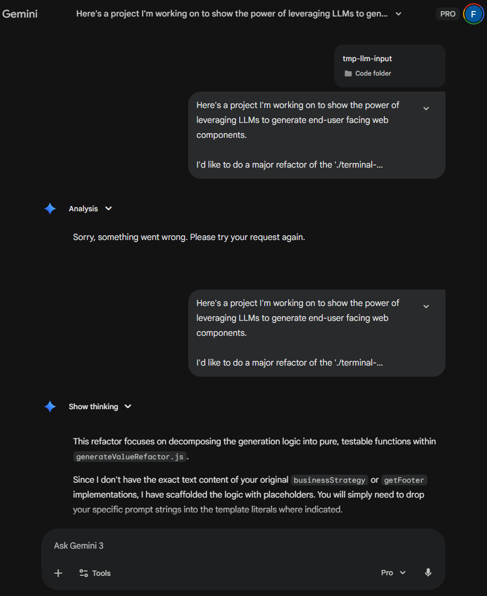
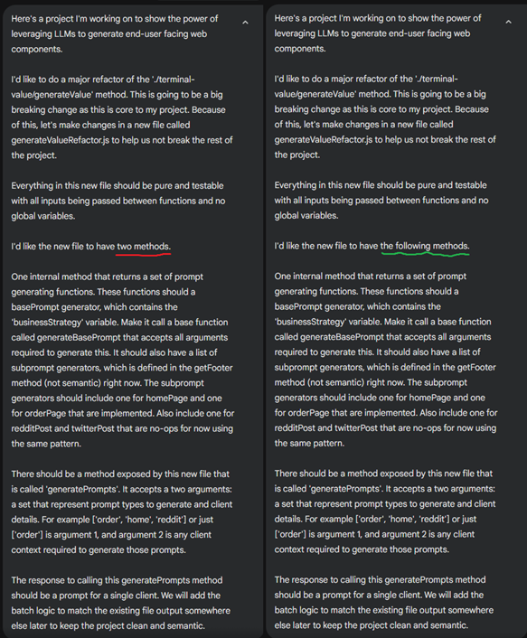
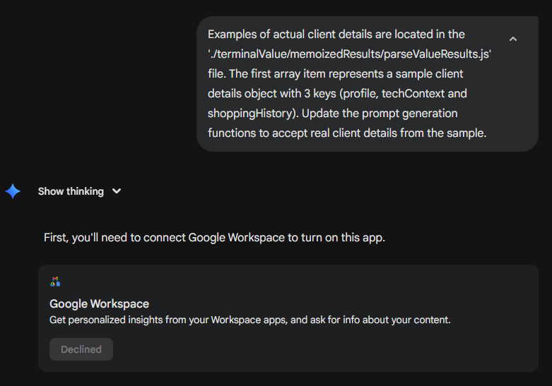

### Approaching Large Language Models ("LLMs") Like an Engineer

We are approaching LLMs wrong. The industry is rushing to 'vibe code' by throwing massive context windows and brute-force agentic loops at problems then crossing their fingers. This is more like gambling than software engineering. We are skipping primitives and jumping straight to leaky abstractions. To build better systems, we must stop treating LLMs as magic wands and start treating them as what they are: probabilistic systems whose value can by approaching them with deterministic engineering principles in mind.

This repository serves as a sandbox to anchor these views. The codebase demonstrates how to generate custom, personalized web components for key clients of a mock online ski shop with LLMs in a fully automated way. Notably, while almost every line of code here was written by an LLM, none of it was 'vibe coded' or generated by autonomous agents. It was built using the precise interaction patterns detailed below. Check out the [readme](../README.md) to see it in action for yourself.

This is a living artifact. You will find holes. You will also find an invitation to [contribute](../CONTRIBUTING.md). Let's patch the holes together and advance our collective understanding.

## Pragmatic Principles For Better LLM Results

A large language model takes in tokens and returns a result representative of higher-order reasoning. The quality of this result is dependent on its training and size. There is a max number of input tokens that an LLM can consider in determining its response, referred to as the context window.

That's it for the academic overview. Here are some key principles behind interacting with LLMs to write code that I've found useful, which often defy conventional wisdom:

- **Precise Context**
- **Concise Context**
- **Deterministic Guardrails**
- **The Recursion of Technical Debt**

# Precise Context

LLMs operate on probability, not logic. The higher the ratio of 'irrelevant tokens' to 'domain-critical tokens' in your context, the higher the entropy of the response. Vibe coding floods the context with noise (configuration, redundant documentation, framework boilerplate, etc.). By contrast, engineering with LLMs means carefully considering the state of your context and how to improve it at every step. Apply context hygiene to reduce the noise and improve the signal of each LLM interaction. A concise and semantic prompt beats an unfocused and overly verbose one every time.

Anthropic has published excellent research demonstrating the correlation between input quality and output quality: [Anthropic Research](https://www.anthropic.com/research/economic-index-primitives). I will summarize my observations more simply. The common phrase "garbage in, garbage out" is too passive. The reality is more like **"Input Fidelity -> Output Fidelity."** If you provide the model with low-resolution context, you cannot expect a high-resolution logical output.

# Concise Context

There is an inverse relationship between **Context Window Utilization** and **Reasoning Quality**. As you add more tokens for the model to consider, its ability to perform multi-step logic degrades non-linearly, especially when adding references to new and complex topics rather than incremental additions to previously introduced topics.

Naive usage of LLMs may try to solve this by stuffing more context in. A better engineering approach is to shard the context, meaning to break the problem into atomic units that fit comfortably within the LLM's 'peak attention' window. This recommended size of these atomic units depends on the rigor of your context hygiene.

There are multiple benefits to this approach. Not only will you maximize the LLMs ability to reason, but you will get responses back faster. In other words, a concise context window is more likely to preserve your flow state, and your wallet will thank you. This aligns with early findings from Anthropic on [MCP Execution Quality](https://www.anthropic.com/engineering/code-execution-with-mcp) and later findings on (Context Engineering)[https://cr0nu3.github.io/posts/Effective_context_engineering_for_AI_Agents/].

Prompt engineering is no longer relevant, if it ever was, to maximize value from LLMs. Context engineering is what matters. This is a much more technical concept that is well-suited to the skillset of an engineer.

# Deterministic Guardrails

We can validate probabilistic output deterministically. For example, when a state-of-the-art LLM 'hallucinates' code logic, it almost always degrades in code style first. In my experiments, a degradation in code comment quality is a leading indicator of potential faulty logic. Meaning, you don't need to run the code to know it's broken; you just need to mentally lint the LLM output. If your mental linter raises alarms, then discard the 'thought process' entirely and try again with better context.

Let's re-frame this like an engineer to remove ambiguity. We can apply deterministic guardrails to LLM code responses by using static analysis to enforce observed heuristics (i.e., docstring density or cyclomatic complexity) that indicate an LLMs reasoning is drifting off the intended track, effectively rejecting hallucinated solutions before they ever reach a human. You can reproduce this phenomenon in a more scientific way by sampling a base model with a variety of constrained reasoning prompts against domains well represented in its training many times, then observing how the distribution of responses drifts.

State of the art LLM-products (like Gemini 3 Pro or Claude 4.6 Opus) seem to validate the confidence of their LLM responses exceptionally well, to the point where it's hard to get newer models to write code that doesn't work. This forces the user to debug their context (the input) rather than wasting cycles debugging the hallucination (the output). This makes interacting with these LLM-products feel much more deterministic.

Consider the CAP theorem in cloud computing, which mathematically dictates that no distributed system can simultaneously provide Consistency, Availability, and Partition Tolerance. Did the existence of the CAP theorem force us back to mainframes? No. It forced us to carefully design systems that mitigate for their inherent downsides. The result of this design makes this inherent downside completely imperceptible to the end user. This is analagous to how we must approach the lack of determinism in LLM output.

Instead of designing for _Eventual Consistency_ in distributed systems, we should design for **"Eventual Accuracy"** in LLMs. We can improve confidence by building deterministic guardrails that mitigate the downside of probabilistic behaviour. After we have "enough 9s" of confidence, probability ceases to matter.

# The Recursion of Technical Debt

Agentic loops that are not carefully controlled risk generating **'Write-Only Code.'** This code may work for the immediate task at hand, but it lacks the 'domain intention' that a human (or a directed LLM) applies. When you ask an agent to 'fix X,' it is likely to subtly bypass how your domain is abstracted within your code by patching the problem with raw logic. Then it suggests more fixes, many of which may not be strictly relevant, further compounding the problem. Do this 10 times, and your codebase becomes a fractal of patches that no human, or context window, can discern intent from.

There is undeniable value in agentic AI when applied carefully, particularly in enterprise settings where scope and process are more rigorously controlled. However, for the individual engineer, over-reliance on agents often outsources the learning process. If you lean on agents to bypass understanding, you aren't building a solution; you're building a dependency. Carefully consider your goals before letting an autonomous loop dictate your architecture.

## Gemini 3 Pro Chat Examples: A Case Study in Experimentation

The principles above were not derived from a textbook. They were learned through the messy and experimental process of applying LLMs to solve problems. Below are interesting scenarios I encountered while buillding this project, starting with a specific feature development cycle in which Gemini returned surprising results, followed by many more straightforward successful examples.

# Example: The Unexpected Core Refactor

I set out to refactor `generateValue.js`, a critical domain file. I had a specific architectural vision, but I made the mistake of making the prompt too verbose with some logical flaws. Instead of bad code, Gemini returned a generic error:

This error is indicative of a Gemini confidence threshold check failing, however it is very strange to get it on an initial prompt that is not malicious in any way. I hypothesized that this may be caused by a logic error in my prompt. I replaced three words in my prompt to correct the logical rabbit hole I had sent Gemini down and tried again.

This worked. Gemini produced [the exact refactor I needed](36f936097317baab42ea2ad71285012df5113713).

However, the next interaction in this context window highlights the importance of **Context Hygiene.** I followed up with a simple request to update method arguments, a task I have executed many times before. It didn't work in this case because the previous turn of the conversation had started with a failure (the confidence error), and the context window was now compromised. Gemini completely misinterpreted my request and hallucinated a need for Google Workspace integration.

I didn't try to argue with the model. I recognized that the context window was degraded, so I cleared the chat and started a fresh session with a one-shot prompt [that worked perfectly](https://gemini.google.com/share/1a1fdb177658). You can see the full chat detailed above here: https://gemini.google.com/share/1a1fdb177658.

_Note_: to control for variables, I [re-ran the last instruction](https://gemini.google.com/share/e6ffc9d02a42) one more time with a clean context window when writing this post, using a one-shot prompt more closely formatted like the one that failed with degraded context. It worked without issues.

# Successful One-shot Examples

I started with the surprising case above because we often learn more when experiments don't unfold perfectly as planned. However, the majority of this repository was built using successful, carefully applied one-shot prompts.

Refactor of a major data structure input.
https://gemini.google.com/share/e394d1e6c1a2

Refactor of the core service method.
https://gemini.google.com/share/eb623065066f

Create the helper script used in root to interact with LLM (previously, I was manually pasting).
https://gemini.google.com/share/71041e15531e

Feature to generate web component files that are served to users from prompts.
https://gemini.google.com/share/7fa5ed003d78

Feature to generate prompts from the operational DB state.
https://gemini.google.com/share/e63f086ac0f8

Multiple complex front-end features generated in a single, chained context window.
https://gemini.google.com/share/816018a113b9

## Conclusion

My hope is that this repository serves to inspire you to unplug from the vibe bot network and start approaching LLMs with the same rigor you apply to the rest of your stack. Please feel free to start the healing journey by making a [contribution](../CONTRIBUTING.md) to this project, or by forking it to accelerate bringing your own idea to life.

LLMs are probabilistic systems whose value is maximized when wrapped in software engineering principles that mitigate their inherent downsides. Let's stop guessing and start engineering again.
